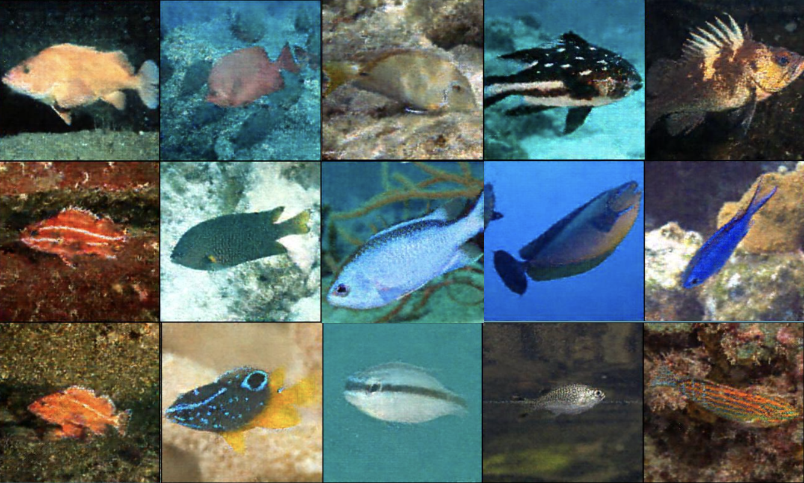

# FINS: Few Shot Image Generation of Novel marine Species



Author: Yu-Kai "Steven" Wang, Jonathan Li, Lawrence Miao

### Introduction
In this project we propose a GAN model specifically designed to generate a specific fish species in a wild background, using as little as 6 high-quality images (few-shot).

This project aims to address the data deficiency problem for fish species, which is the main obstacle for Automatic species Identification Systems (AIS). A good AIS can provide insights on population, biodiversity, and migration patterns, which is essential for the conservation of the marine ecosystem as a whole. 

The datasets and model weights are available [here](https://drive.google.com/drive/folders/1VCwr3p1J4BbkLUmc7vYvaqJ-qleGqUWQ?usp=sharing)

See `QA.md` for more details.

### Dataset
We cleaned a small subset of images (20 species) derived from the [Wildfish++ dataset](https://dl.acm.org/doi/10.1109/TMM.2020.3028482) for pretraining.

For testing, we also curated a small dataset of the novel fish species *Sinocyclocheilus longicornus* (discovered in 2023).
Sources for these images are listed below:
1. [link 1](https://www.sci.news/biology/sinocyclocheilus-longicornus-11592.html)
2. [link 2](https://cavefishes.org.uk/species-record.php?id=77)
3. [link 3](https://www.popsci.com/environment/unicorn-fish-china/)
4. [link 4](https://www.bulbapp.com/u/meet-the-organisms~14)
5. [link 5](https://www.researchgate.net/figure/An-adult-Sinocyclocheilus-furcodorsalis-Note-the-dorsal-hump-skull-horn-and-absence-of_fig1_331726289)
6. [link 6](https://www.researchgate.net/figure/Sinocyclocheilus-rhinocerous-ASIZB93907-standard-length-782-mm-Photo-by-Zhao-Y_fig48_226580955)

### Model
We adapted [lucidrains' implementation of the lightweight GAN](https://github.com/lucidrains/lightweight-gan), which is a PyTorch implementation of the architecture described in the paper [Towards Faster and Stabilized GAN Training for High-fidelity Few-shot Image Synthesis](https://openreview.net/forum?id=1Fqg133qRaI) (Liu Et al.). On top of this we also implemented the regularization technique described in the paper [Few-shot Image Generation with
Elastic Weight Consolidation](https://papers.nips.cc/paper/2020/file/b6d767d2f8ed5d21a44b0e5886680cb9-Paper.pdf) for finetuning.

In this project we propose a two-stage training of the lightweight GAN: 1. we first pre-train the model on a variety of fish species. 2. We then finetune the model to adapt to new species in a few-shot setting. 

### Installation

This project is only tested on python 3.12. Install the required packages with the following command.

```
pip install -r requirements.txt
```

### Training

For pretraining:
```
lightweight_gan --data <path-to-large-image-folder> --name <name-of-run> --batch-size 64 --num-train-steps 350000
```

For finetuning:
```
lightweight_gan --data <path-to-target-species-image-folder> --name <name-of-run> --batch-size 4 --lr 0.0001 --num-train-steps 370000 --finetune
```

### Generation

```
lightweight_gan --name <name-of-run> --load-from <checkpoint-num> --generate
```

### Disclaimer

This project is only intended for research purposes only.

### Baseline Models
Included in `src` are 3 additional models used during experimentation.
1. [Deep Convolutional Generative Adversarial Network (DCGAN)](https://arxiv.org/pdf/1511.06434v2): Code adapted from https://github.com/eriklindernoren/PyTorch-GAN/blob/master/implementations/dcgan/dcgan.py
2. [Denoising Diffusion Probabilistic Model (DDPM)](https://arxiv.org/pdf/2006.11239)
3. [Text Guided Diffusion](https://huggingface.co/stabilityai/stable-diffusion-2-1-base)

